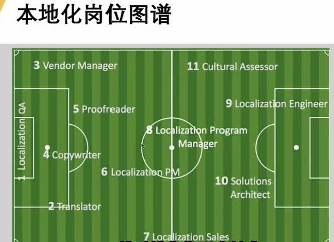
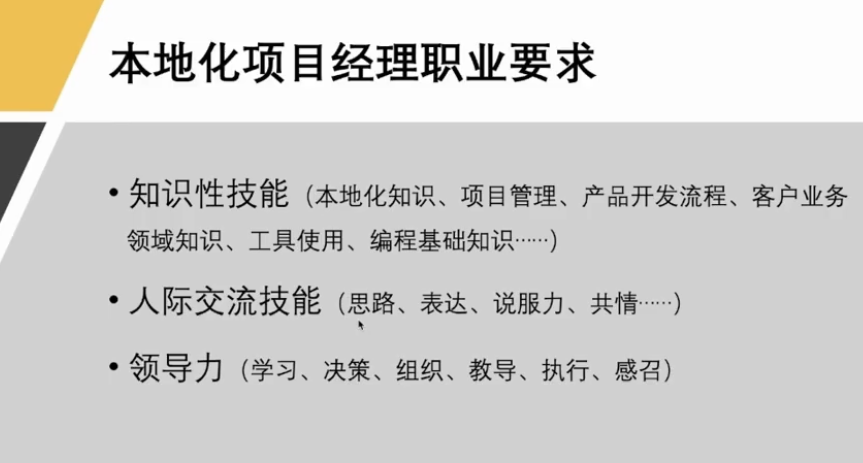

# Miscellaneous items

## Database learning material
  1. [MySQL—入门基础知识（一看就懂，一学就会）
](https://blog.csdn.net/YJ000312/article/details/123790957?ops_request_misc=&request_id=&biz_id=102&utm_term=数据库入门&utm_medium=distribute.pc_search_result.none-task-blog-2~all~sobaiduweb~default-3-123790957.142^v99^pc_search_result_base7&spm=1018.2226.3001.4187)
  2. [一文初步认识数据库内核](https://zhuanlan.zhihu.com/p/556909884)

## Localization resources
  1. [北京大学】计算机辅助翻译原理与实践（俞劲松）](https://space.bilibili.com/1033739762/channel/collectiondetail?sid=936435)
  2. [翻译技术点津](https://space.bilibili.com/1033739762/channel/series)

